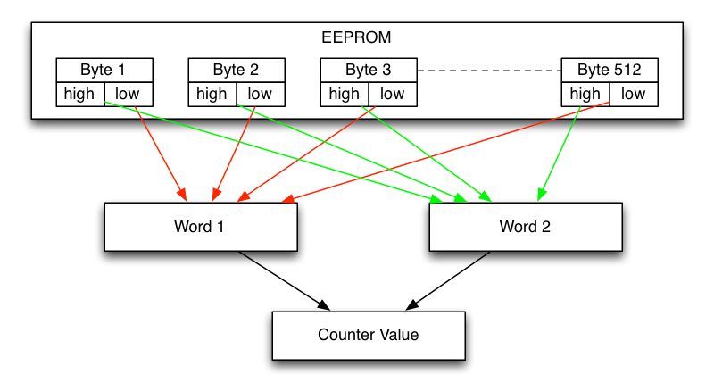

# EEPROM

## The Problem

Simply writing the number of wheel turns into the EEPROM will not suffice. The EEPROM has limitations when it comes to the amount of writes you can do. In case of the Attiny85 this is about 100,000 guaranteed writes before the EEPROM will start to fail. Only being able to write 100,000 wheel turns into the EEPROM e.g. would mean the odometer would be prone to fail after just about 100,000 x 2.075/1000 = 207.5 km (for a 26" wheel). To get around this limitation the load of writing the EEPROM cells has to be distributed across multiple (all) cells.

## Wear Leveling

The algorithm for storing the number of wheel turns in the EEPROM should have certain properties:

* Evenly distribute writes among the EEPROM bytes.
* Only write one EEPROM byte per increment to make increments atomic.
* Make the counter large enough to store at least 100,000 km of wheel turns.
* Stay close to the guaranteed 100,000 EEPROM writes the data sheet specifies.

To achieve these points the EEPROM is divided up into two words. The first word is made up of all the 512 low nibbles and the second word is made up of all the high nibbles. The value of these words is calculated by summing up the nibbles (a value between 0-16) of each word. Both words are then used as **L**east **S**ignificant **W**ord and **M**ost **S**ignificant **W**ord to form the total counter value. This leads to a maximum value for the wheel turn counter of:

(16 x 512) * (16 x 512) = 67,108,864 or about 139,250 km for a 26" wheel

Each EEPROM byte can be written at least 100,000 times which leeds to a total of (100,000 x 512) = 51,200,000 guaranteed EEPROM writes. Both these values make it reasonable to assume that the EEPROM will not fail until the odometer wheel counter rolls over back to zero after well over 100,000 km of usage.

## Content

You can take a look at the EEPROM content using the AVR ISP and avrdude:

<pre>
mini% make eeprom
# read EEPROM to stdout
avrdude -q -P usb -c avrispmkII -p attiny85 -U eeprom:r:-:d

avrdude: AVR device initialized and ready to accept instructions
avrdude: Device signature = 0x1e930b (probably t85)
avrdude: reading eeprom memory:
avrdude: writing output file "<stdout>"
22,22,22,22,22,22,22,22,22,22,22,6,7,7,7,7,7,7,7,7,7,7,7,7,7,7,7,7,7,7,7,7,7,7,7
,7,7,7,7,7,7,7,7,7,7,7,7,7,7,7,7,7,7,7,7,7,7,7,7,7,7,7,7,7,7,7,7,7,7,7,7,7,7,7,7
,7,7,7,7,7,7,7,7,7,7,7,7,7,7,7,7,7,7,7,7,7,7,7,7,7,7,7,7,7,7,7,7,7,7,7,7,7,7,7,7
,7,7,7,7,7,7,7,7,7,7,7,7,7,7,7,7,7,7,7,7,7,7,7,7,7,7,7,7,7,7,7,7,7,7,7,7,7,7,7,7
,7,7,7,7,7,7,7,7,7,7,7,7,7,7,7,7,7,7,7,7,7,7,7,7,7,7,7,7,7,7,7,7,7,7,7,7,7,7,7,7
,7,7,7,7,7,7,7,7,7,7,7,7,7,7,7,7,7,7,7,7,7,7,7,7,7,7,7,7,7,7,7,7,7,7,7,7,7,7,7,7
,7,7,7,7,7,7,7,7,7,7,7,7,7,7,7,7,7,7,7,6,6,6,6,6,6,6,6,6,6,6,6,6,6,6,6,6,6,6,6,6
,6,6,6,6,6,6,6,6,6,6,6,6,6,6,6,6,6,6,6,6,6,6,6,6,6,6,6,6,6,6,6,6,6,6,6,6,6,6,6,6
,6,6,6,6,6,6,6,6,6,6,6,6,6,6,6,6,6,6,6,6,6,6,6,6,6,6,6,6,6,6,6,6,6,6,6,6,6,6,6,6
,6,6,6,6,6,6,6,6,6,6,6,6,6,6,6,6,6,6,6,6,6,6,6,6,6,6,6,6,6,6,6,6,6,6,6,6,6,6,6,6
,6,6,6,6,6,6,6,6,6,6,6,6,6,6,6,6,6,6,6,6,6,6,6,6,6,6,6,6,6,6,6,6,6,6,6,6,6,6,6,6
,6,6,6,6,6,6,6,6,6,6,6,6,6,6,6,6,6,6,6,6,6,6,6,6,6,6,6,6,6,6,6,6,6,6,6,6,6,6,6,6
,6,6,6,6,6,6,6,6,6,6,6,6,6,6,6,6,6,6,6,6,6,6,6,6,6,6,6,6,6,6,6,6,6,6,6,6,6

avrdude: safemode: Fuses OK (E:FF, H:D6, L:62)

avrdude done.  Thank you.
</pre>

Date: 2019-11-05
