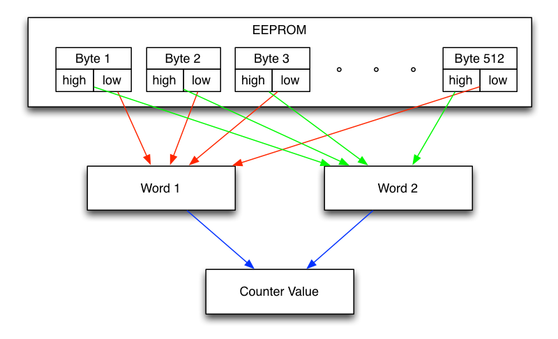

# EEPROM

## The Problem

Simply writing the number of wheel turns into the EEPROM will not suffice. The EEPROM has limitations when it comes to the amount of writes you can do. In case of the Attiny85 this is about 100,000 guaranteed writes before the EEPROM will start to fail. Only being able to write 100,000 wheel turns into the EEPROM e.g. would mean the odometer would be prone to fail after just about 100,000 * 2.075/1000 = 207.5 km (for a 26" wheel). To get around this limitation the load of writing the EEPROM cells has to be distributed across multiple (all) cells.

## Wear Leveling

The **L**east **S**ignificant **B**yte for storing the wheel turns is obviously the one most affected by the EEPROM write limitations. The LSB gets written with every new wheel turn. Instead of writing only one EEPROM byte the odometer uses the first 510 EEPROM bytes to store the LSB. The second and third byte get stored in the last two bytes of the EEPROM. This comes to a theoretical maximum of:

(256 * 510) * (256) * (256) = 8,556,380,160 wheel turns

or 17,754,488 km for a 26" wheel. Due to the EEPROM write limitations this value is reduced to about:

100,000 * 510 = 51,000,000 wheel turns

or about 105,825 km for a 26" wheel. This is close to 100,000 km for most bicycles out there and should be adequate. Also having a limit of 100,000 EEPROM writes in the Attiny85 does not mean it will automatically fail after 100,001 writes. It only means that Atmel will certify that the EEPROM will work for at least 100,000 write cycles and that after that you are on your own.

## Content

You can take a look at the EEPROM content using the AVR ISP and avrdude:

<pre>
mini% make eeprom
# read EEPROM to stdout
avrdude -q -P usb -c avrispmkII -p attiny85 -U eeprom:r:-:d

avrdude: AVR device initialized and ready to accept instructions
avrdude: Device signature = 0x1e930b (probably t85)
avrdude: reading eeprom memory:
avrdude: writing output file "<stdout>"
12,12,12,12,12,12,12,12,12,12,12,12,12,12,12,12,12,12,12,12,12,12,12,12,12,12,12,12,12,12,12,12,
12,12,12,12,12,12,12,12,12,12,12,12,12,12,12,12,12,12,12,12,12,12,12,12,12,12,12,12,12,12,12,12,
12,12,12,12,12,12,12,12,12,12,12,11,11,11,11,11,11,11,11,11,11,11,11,11,11,11,11,11,11,11,11,11,
11,11,11,11,11,11,11,11,11,11,11,11,11,11,11,11,11,11,11,11,11,11,11,11,11,11,11,11,11,11,11,11,
11,11,11,11,11,11,11,11,11,11,11,11,11,11,11,11,11,11,11,11,11,11,11,11,11,11,11,11,11,11,11,11,
11,11,11,11,11,11,11,11,11,11,11,11,11,11,11,11,11,11,11,11,11,11,11,11,11,11,11,11,11,11,11,11,
11,11,11,11,11,11,11,11,11,11,11,11,11,11,11,11,11,11,11,11,11,11,11,11,11,11,11,11,11,11,11,11,
11,11,11,11,11,11,11,11,11,11,11,11,11,11,11,11,11,11,11,11,11,11,11,11,11,11,11,11,11,11,11,11,
11,11,11,11,11,11,11,11,11,11,11,11,11,11,11,11,11,11,11,11,11,11,11,11,11,11,11,11,11,11,11,11,
11,11,11,11,11,11,11,11,11,11,11,11,11,11,11,11,11,11,11,11,11,11,11,11,11,11,11,11,11,11,11,11,
11,11,11,11,11,11,11,11,11,11,11,11,11,11,11,11,11,11,11,11,11,11,11,11,11,11,11,11,11,11,11,11,
11,11,11,11,11,11,11,11,11,11,11,11,11,11,11,11,11,11,11,11,11,11,11,11,11,11,11,11,11,11,11,11,
11,11,11,11,11,11,11,11,11,11,11,11,11,11,11,11,11,11,11,11,11,11,11,11,11,11,11,11,11,11,11,11,
11,11,11,11,11,11,11,11,11,11,11,11,11,11,11,11,11,11,11,11,11,11,11,11,11,11,11,11,11,11,11,11,
11,11,11,11,11,11,11,11,11,11,11,11,11,11,11,11,11,11,11,11,11,11,11,11,11,11,11,11,11,11,11,11,
11,11,11,11,11,11,11,11,11,11,11,11,11,11,11,11,11,11,11,11,11,11,11,11,11,11,11,11,11,11,0,0

avrdude: safemode: Fuses OK (E:FF, H:D6, L:62)

avrdude done.  Thank you.
</pre>

Date: 2019-11-05
