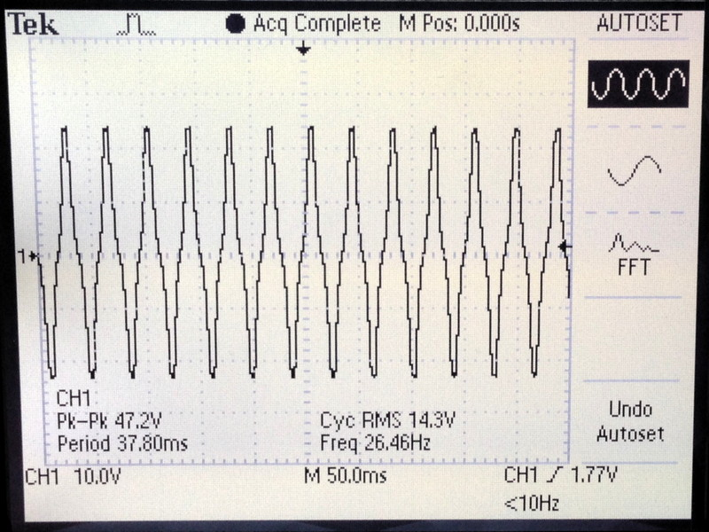
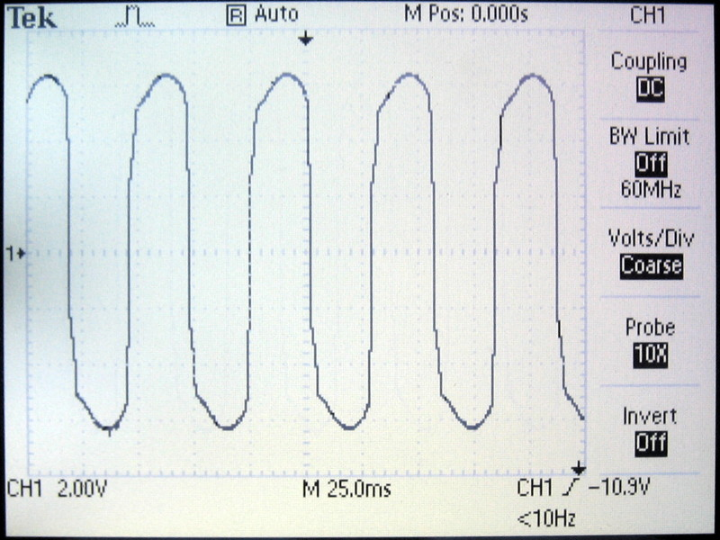

# Generator

## Description

Bicycle wheel hub generators typically produce 3 Watts of 6 Volts AC. Depending on how fast the front wheel turns the frequency of the alternating current goes up or down. Different brands of wheel hub generators also produce different numbers of AC half-waves per wheel turn. The SON generator I use produces 26 half-waves (or 13 full-waves) per wheel turn. Also the voltage of the generator can vary depending on the load attached to it (e.g. lights on or off). All this needs to be considered when designing the different parts of the odometer. Below you can see the voltage of the generator running idle:

And this image shows the voltage under load with the lights on:

Date: 2019-11-05
