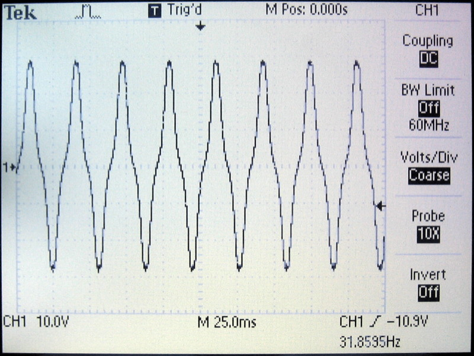

# Generator

## Description

Bicycle wheel hub generators typically produce 3 Watts of 6 Volts AC. Depending on how fast the front wheel turns the frequency of the alternating current goes up or down. Different brands of wheel hub generators also produce different numbers of AC half-waves per wheel turn. The SON 28 generator I use produces 26 half-waves (or 13 full-waves) per wheel turn. Also, the voltage of the generator can vary depending on the load attached to it (e.g. lights on or off). All this needs to be considered when designing the different parts of the odometer. Below you can see the voltage of the generator running idle:

And this image shows the voltage under load with the lights on:

Depending upon the revolutions per minute of the front wheel (speed of the bicycle) the voltage of the generator changes when running idle (without the lights on). The SON 28 generator produces about 9.5 Volts at 10 km/h and twice as much at 20 km/h etc. (with a 26" wheel). This is an almost linear relationship that leads to very high voltages at high speeds.

Date: 2019-11-05
