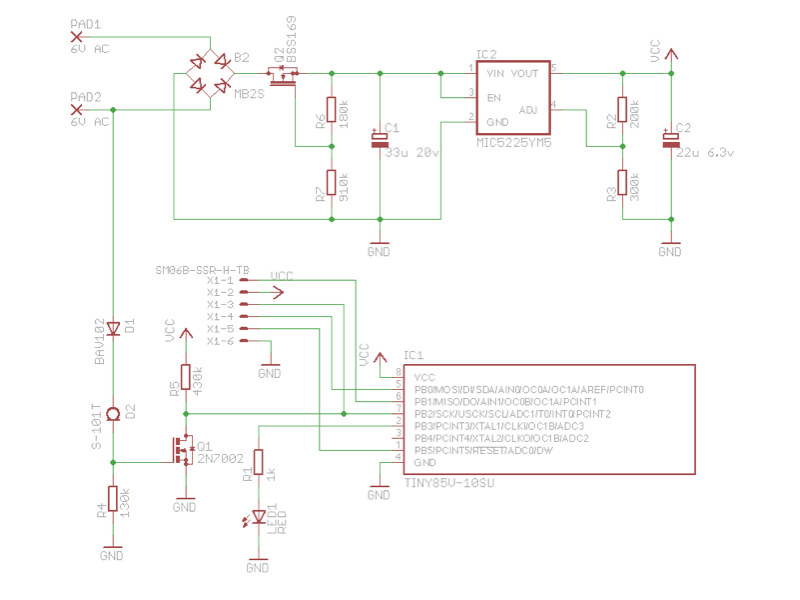
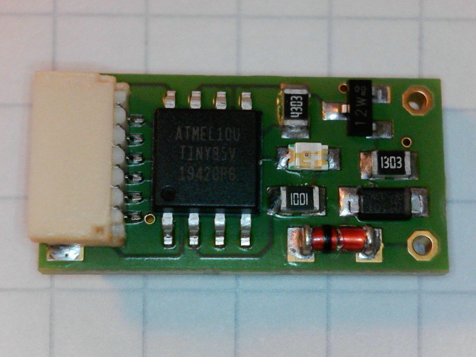
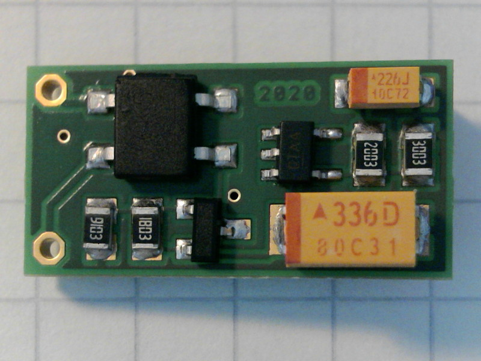

# Hardware

## Schematic

The Attiny85 is a "V" version which means it can run on lower voltages (2.1 Volts in this setup). It has 8 kb of FLASH, 512 bytes of RAM and a 512 byte EEPROM. The Calibrated Internal Oscillator is running at 8 MHz with a prescaler of 8. This leads to a clock frequency of 1 MHz. 

Brown-out detection is set to 1.8 Volts using the fuses of the Attiny85. It is very important to enable brown-out detection or otherwise the EEPROM content will get corrupt. Brown-out detection makes sure any ongoing EEPROM write will get done in case the power starts failing. 

The MIC5233 LDO voltage regulator has an enable pin which shuts down the regulator when the input voltage goes below 2 Volts. In shutdown mode the voltage regulator uses (almost) no power.

The AC voltage of the hub generator is also rectified by a single diode. This signal is then cleaned up by a transistor and feed into counter/timer 0 of the tiny.

To get some optical feedback of the odometer working port 3 of the tiny is connected to a LED.

The JST connector has the six pins needed for the **I**n **S**ystem **P**rogramming (ISP). The half duplex UART implemented using the **U**niversal **S**erial **I**nterface (USI) is also accessible via this connector. The UART operates with 9600 baud, 8 data, no parity and 1 stop bit. RX and TX are TTL level inputs/outputs.

There are two additional pads on the input side of the voltage regulator. These are for adding an extra polarised capacitor if needed.

Below you can see the prototype PCB. It is about 20x10 mm in size:

## Parts List

|Part    |Value           | Package        |
|:------:|:--------------:|:--------------:|
|B2      | MB6S           | SOIC-4         |
|C1      | 22u 35v        | SMC_D          |
|C2      | 10u 10v        | SMC_B          |
|D1      | LL4148         | SOD80C         |
|IC1     | TINY85V-10SU   | SOIC-8         |
|IC2     | MIC5233YM5     | SOT25          |
|LED1    | RED            | 0805           |
|Q1      | 2N7002         | SOT23          |
|R1      | 1k             | 0805           |
|R2      | 150k           | 0805           |
|R3      | 220k           | 0805           |
|R4      | 100k           | 0805           |
|R5      | 100k           | 0805           |
|X1      | SM06B-SSR-H-TB | SM06B-SSR-H-TB |

## ISP Pinout

JST SH 6 pin connector 1mm pitch

* 1 MISO
* 2 VCC
* 3 SCK
* 4 MOSI
* 5 Reset
* 6 GND

## Serial Pinout

JST SH 6 pin connector 1mm pitch

* 1 TX
* 2 VCC
* 3 
* 4 RX
* 5 
* 6 GND

Date: 2019-11-18
