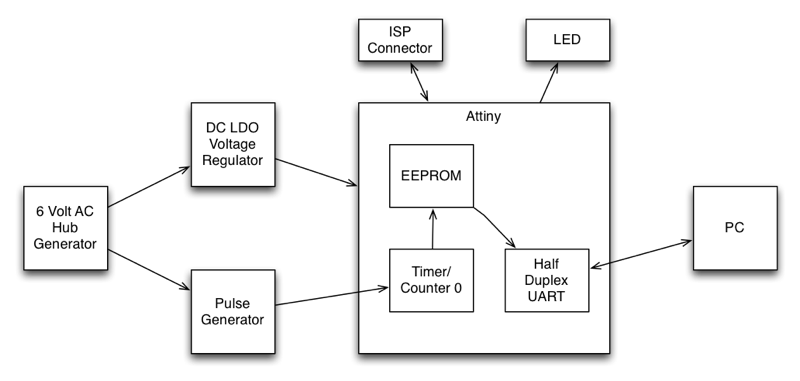

# Software

## Architecture

The odometer uses timer/counter 0 to count the half-waves sent by the hub generator. After one wheel turn of half-waves the counter issues an interrupt which causes the CPU to write a new value into the EEPROM. Using timer/counter 0 has advantages and also one disadvantage. The advantage for the odometer is the CPU can go to sleep while the half-waves are being counted. The timer/counter 0 will work even when the CPU is in IDLE sleep mode. This is much more efficient than generating an interrupt for every half-wave sent. The disadvantage is I can't use the timer/counter 0 anymore for the **U**niversal **S**erial **I**nterface (USI). Timing for the USI half duplex UART will have to be done using timer/counter 1. Timer/counter 1 can't be connected directly (in hardware) to the USI. It is only possible to strobe the USI in software using timer/counter 1 which is less precise and not interrupt save.

## Usage

The simplest way to readout the odometer is to use a terminal program like `screen`. After connecting to the serial adapter press "p" and "return" and the odometer will display the total number of wheel turns. To exit `screen` press "control a" and "k".

<pre>
mini% screen /dev/tty.usbserial-A403JXK2 9600
p
93821
</pre>

You can also set a value using the "s" command. While the EEPROM is being programmed the LED will be on to give feedback when the command is done (takes about two seconds).

<pre>
mini% screen /dev/tty.usbserial-A403JXK2 9600
p
0
s93822
p
93822
</pre>

And you can also increment the counter using the "i" command without having the odometer hooked up to your bike:

<pre>
mini% screen /dev/tty.usbserial-A403JXK2 9600
p
93821
i
p
93822
</pre>

Or you can use the `km.pl` Perl script which converts the wheel turns into kilometers. The Perl installation requires the "Device::SerialPort" module to work.

<pre>
mini% ./km.pl 
11.8 km
</pre>

Date: 2019-11-05
