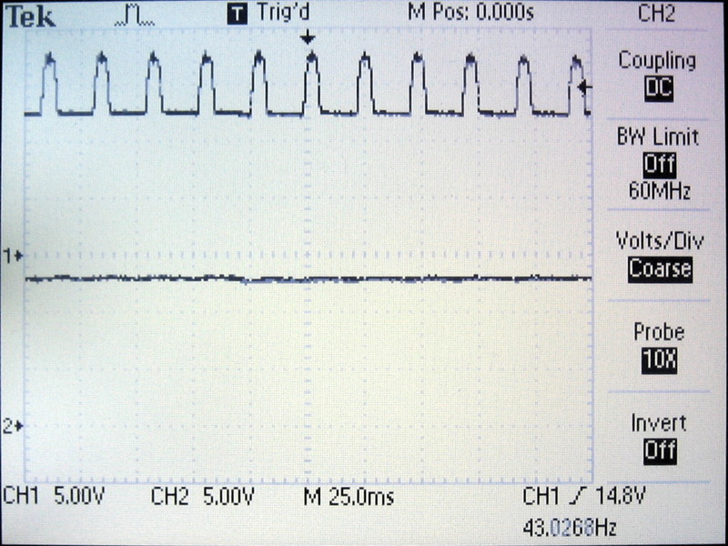
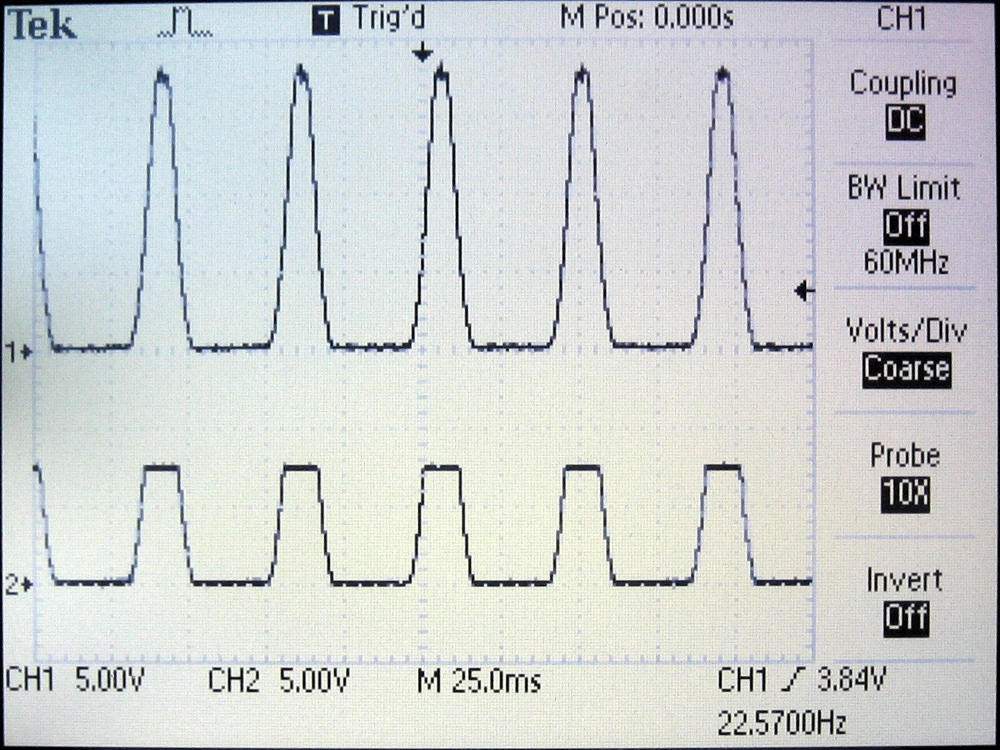
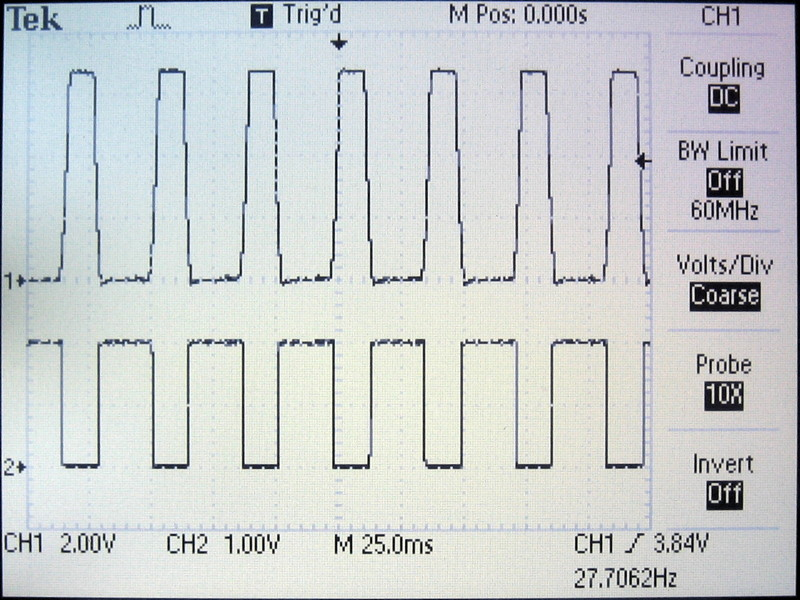
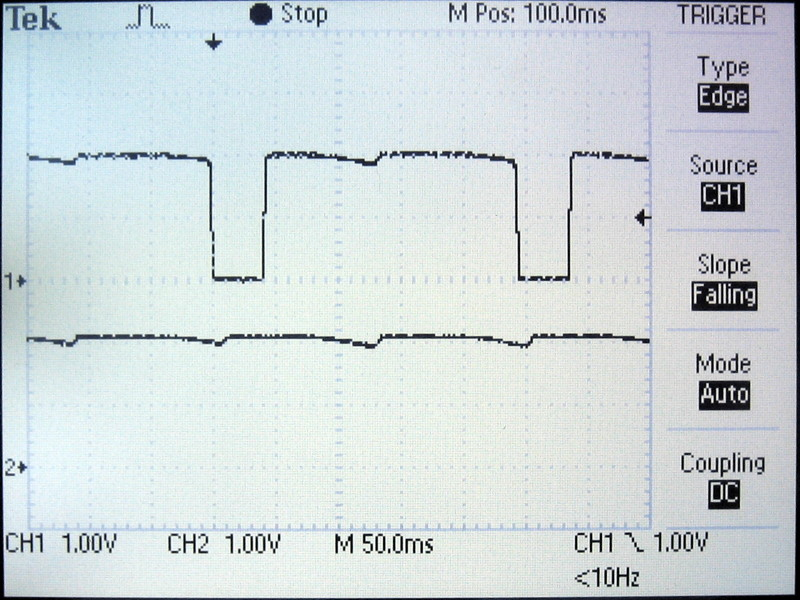

# Testing

Below you can see the depletion mode MOSFET Q2 keeping any excess voltage greater than 13 Volts away from the voltage regulator. Channel 1 shows the signal at the drain and channel 2 the signal at the source of transistor Q2. All the rectified half waves greater than 13 Volts will not pass transistor Q2.

The two pictures below show the signal processing used to count the half waves. The first image shows the signal before and after the **C**urrent **R**egulating **D**iode (CRD). You can see the CRD pinching off the excess voltage at around 8 Volts. And the second one shows the signal at the gate (channel 1) and drain (channel 2) of the transistor Q1. Channel 2 shows the cleaned, voltage adjusted, inverted signal feed into timer/counter 0.

The image below shows the signal being feed into timer/counter 0 (channel 1). And the second signal shows the 2.1 Volts used to power the tiny (channel 2). The image was taken when the power started failing which can be seen by the little dents in the supply voltage. The full wave period of the timer/counter 0 signal is at about 230 milli seconds. Using this you can calculate the speed the front wheel was moving when the power started failing (assuming a 26" wheel):

((2.075 m / (0.23 ms x 13)) x 60 x 60) / 1000 ≈ 2.49 km/h  

Total power consumption is at about 0.46 milli Amps on average (measured at the hub generator input). The power usage fluctuates when the LED comes on. Even more power could be saved by turning off the LED but it is hardly worth it. The main power consumer is the Attiny.

If you run into issues with the serial connection try adjusting the USI_BAUD_DELAY value in the odometer.h file. By increasing or decreasing the value by 1 or 2 you can adjust the baud rate to slightly different hardware like e.g. the internal oscillator or another serial adapter. Please remember the USI is strobed in software (not hardware) and therefore is not as precise as it could be.

Date: 2019-11-17
