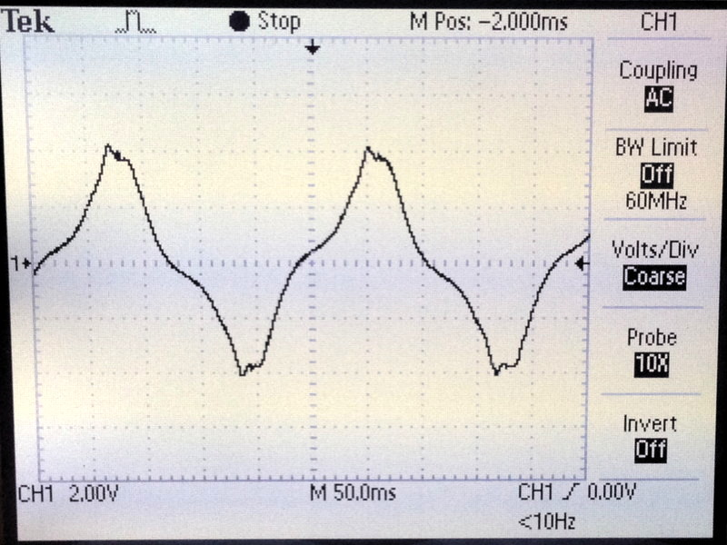
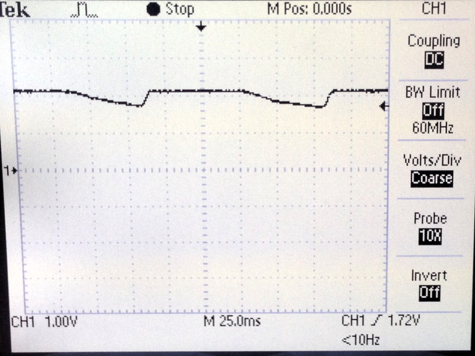
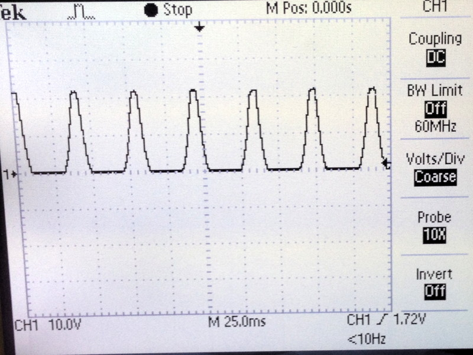
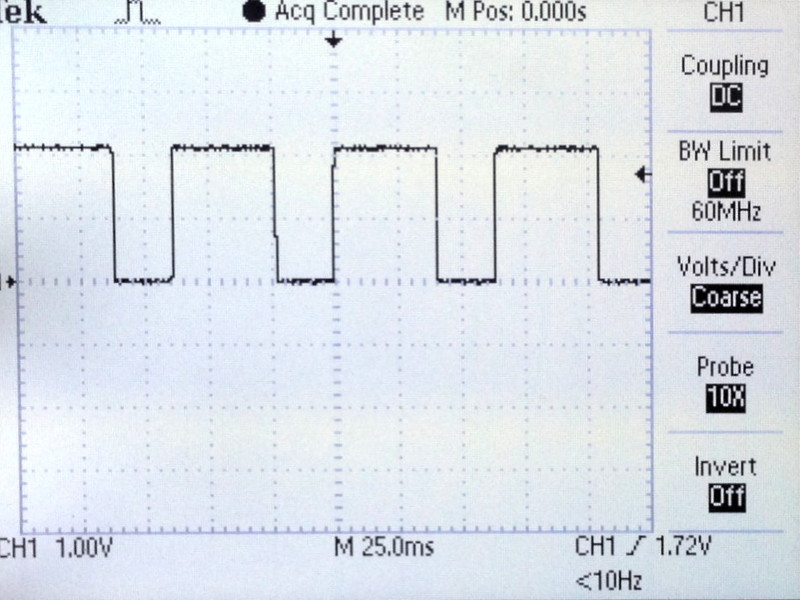

# Testing

First tests show that the odometer stops working when the generator voltage comes down to about 8 Volts peak to peak (about 3.3 Volts after being rectified). At this wheel speed the AC frequency is down to about 4 Hz. If I did my math right this means the bike needs to move with at least about 2.5 km/h for the odometer to work. I will try to improve on power consumption to get this value down even further.

Here is what the voltage looks like once it's failing on the output side of the LDO voltage regulator:

The two pictures below show the signal processing used to count the half waves. The first image shows the signal at the gate of the transistor after being rectified by the diode. And the second one shows the clean, inverted signal at the drain/input into timer/counter 0.

Total power consumption is at about 0.46 milli Amps on average (measured at the hub generator input). The power usage fluctuates when the LED comes on. Even more power could be saved by turning off the LED but it is hardly worth it. The main power consumer is the Attiny.

If you run into issues with the serial connection try adjusting the USI_BAUD_DELAY value in the odometer.h file. By increasing or decreasing the value by 1 or 2 you can adjust the baud rate to slightly different hardware like e.g. the internal oscillator or another serial adapter. Please remember the USI is strobed in software (not hardware) and therefore is not as precise as it could be.

Date: 2019-11-17
